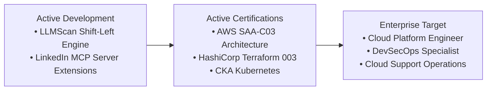

# Dhiren Devdas Bhandare
### Cloud Platform & DevSecOps Engineer $\cdot$ Enterprise IT Systems Specialist

**Master of Computer Science (Data Science & AI, Cloud & Security) @ The University of Sydney**  
**Academic WAM: 78.0 (Distinction)** $\cdot$ Sydney, NSW, Australia 🇦🇺  
*5+ Years Enterprise IT Operations & Infrastructure Support (ServiceNow $\cdot$ Active Directory $\cdot$ EUC)*

 

---

### 👨‍💻 Executive Profile

I am a postgraduate Computer Science candidate at **The University of Sydney (USYD)** specializing in **Data Science & AI** and **Cybersecurity**, backed by **5+ years of enterprise IT systems and infrastructure operations experience**. 

My core focus bridges production enterprise stability with modern cloud-native platform engineering and automated DevSecOps pipelines:
- ☁️ **Cloud Infrastructure & IaC:** Designing scalable, reproducible infrastructure on **AWS**, declarative provisioning via **HashiCorp Terraform**, and containerized orchestration across **Docker**, **Podman**, and **Kubernetes**.
- 🛡️ **DevSecOps & AI Security:** Implementing shift-left security guardrails, automated Static Application Security Testing (SAST), OWASP Top 10 vulnerability auditing, and container runtime isolation.
- 🏢 **Enterprise Systems & Operations:** 5+ years supporting mission-critical enterprise environments — managing ServiceNow incident/change lifecycles, enterprise Active Directory least-privilege RBAC, and EUC systems.
- 🤖 **Autonomous AI & Platform Tooling:** Engineering high-performance Model Context Protocol (MCP) servers, multi-agent evaluation pipelines, and low-latency asynchronous microservices with FastAPI and Python.

---

### 🌟 Featured Engineering Repositories & Systems

| System / Repository | Focus Area | Architecture & Capabilities | Stack |
| :--- | :--- | :--- | :--- |
| 🔌 **[linkedin-mcp-server](https://github.com/3XCeptional/linkedin-mcp-server)** | AI Tooling / MCP | **Open-source Model Context Protocol server.** Grants Claude and autonomous AI swarms structured, authenticated access to professional graph data, profile intelligence, and job workflows. | `TypeScript` `MCP Protocol` `Playwright` `Node.js` |
| 🛡️ **[llmscan](https://github.com/3XCeptional/LLMSCAN)** | DevSecOps / AI Security | **Automated AI security & shift-left CI/CD guardrail testing.** Scans LLM prompts, agent toolchains, and model interactions against OWASP LLM Top 10 vulnerabilities, prompt injection, and data exfiltration. | `Python` `FastAPI` `SAST` `Docker` `CI/CD` |
| 📡 **[exceptional-blogs](https://3xceptional.github.io/exceptional-blogs/)**  *([Source](https://github.com/3XCeptional/exceptional-blogs))* | Cloud Intelligence | **Autonomous intelligence & security briefing engine.** Automated pipeline continuously synthesizing breaking CVEs, cloud platform engineering patterns, and enterprise architectural analyses. | `React` `Vite` `Python` `GitHub Actions` `Pages` |
| 🧠 **[GEN_AI](https://github.com/3XCeptional/GEN_AI)** | Agentic AI Systems | **Autonomous agent harnesses & evaluation benchmarks.** Multi-agent decision consensus gates, structured tool calling pipelines, and deterministic LLM judgment frameworks. | `Python` `LangChain` `LLM APIs` `Multi-Agent` |
| 🔬 **[Machine_learning](https://github.com/3XCeptional/Machine_learning)** | Data Science & Modeling | **Applied ML & deep learning architectures.** End-to-end data processing pipelines, neural network models, feature engineering pipelines, and statistical modeling benchmarks. | `PyTorch` `Scikit-Learn` `Pandas` `NumPy` |
| 📐 **[DSA](https://github.com/3XCeptional/DSA)** | Systems & Algorithms | **Algorithms & computational complexity suite.** High-performance implementations, dynamic programming solutions, graph optimizations, and asymptotic complexity benchmarks. | `C++` `Python` `Algorithms` `Optimization` |

---

### 📋 Live Projects & Engineering Roadmap

Engineering deliverables, certification milestones, and active platform development are tracked on GitHub Projects:

👉 **[Explore Current Sprints & Milestones on GitHub Projects &rarr;](https://github.com/3XCeptional?tab=projects)**

---

### 🛠️ Technical Competency Matrix

<table>
  <tr>
    <td width="25%"><strong>Cloud & Infrastructure</strong></td>
    <td>
      
      
      
      
      
      
      
      
    </td>
  </tr>
  <tr>
    <td><strong>Security & DevSecOps</strong></td>
    <td>
      
      
      
      
      
    </td>
  </tr>
  <tr>
    <td><strong>Enterprise IT & Ops</strong></td>
    <td>
      
      
      
      
      
    </td>
  </tr>
  <tr>
    <td><strong>Backend & Languages</strong></td>
    <td>
      
      
      
      
      
      
      
      
    </td>
  </tr>
  <tr>
    <td><strong>AI & Data Systems</strong></td>
    <td>
      
      
      
      
      
      
    </td>
  </tr>
</table>

---

### 🎓 Academic & Professional Credentials

- **Master of Computer Science (Data Science & AI, Cloud & Cybersecurity)**  
  *The University of Sydney (USYD)* $\cdot$ 2026 – Present  
  **Academic WAM:** 78.0 (Distinction)
- **Bachelor of Computer Applications (B.C.A.)**  
  *Grade A (75.09%)*
- **Enterprise IT Experience:**  
  *5+ Years Enterprise IT Systems & Technical Support* — Enterprise Service Desk, ServiceNow Incident & Request Automation, Active Directory User & Group Policy Governance, Hardware/EUC Deployments.

---

### 📊 Engineering Activity & Metrics

  

**Sydney, NSW, Australia 🇦🇺 $\cdot$ Open to Cloud Platform & DevSecOps Opportunities**

